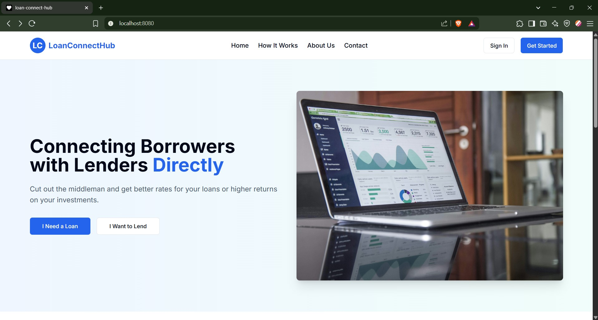
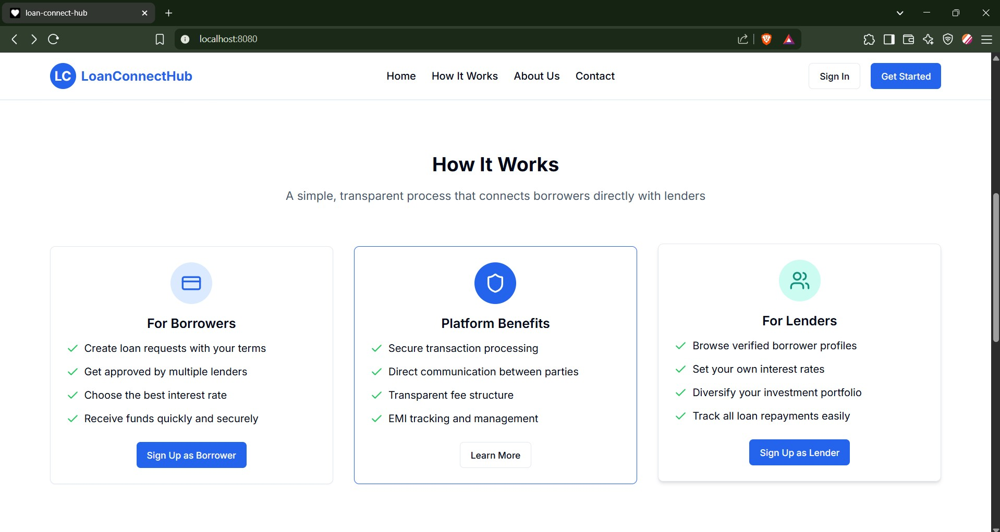
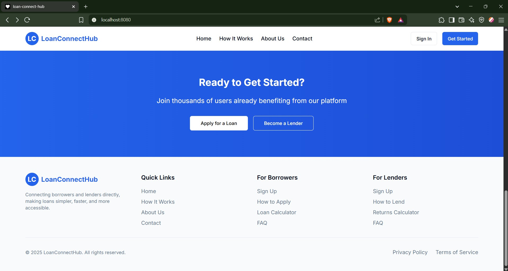
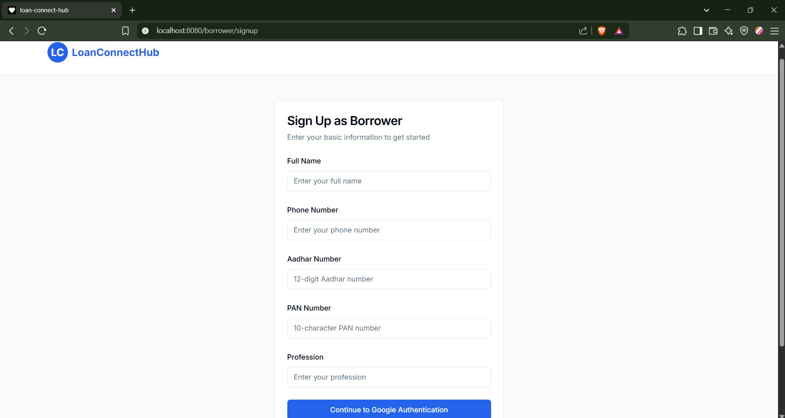
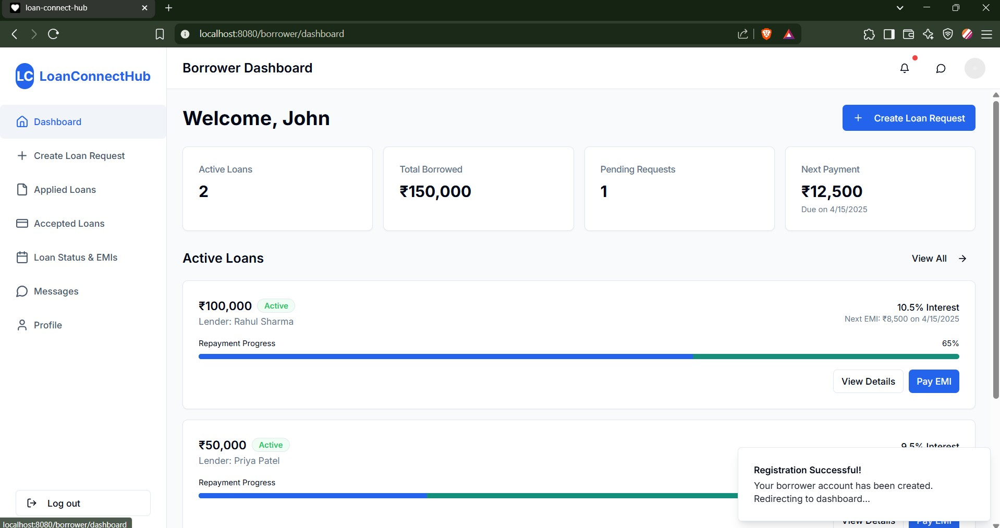

# Loan-Connect-Hub

A peer-to-peer lending platform connecting borrowers with potential lenders in a secure and user-friendly environment. This project was developed during a 24-hour hackathon held by Dr. D. Y. Patil Institute of Technology, Pimpri.

## 📑 Table of Contents
- [Overview](#overview)
- [Features](#features)
- [Tech Stack](#tech-stack)
- [Project Structure](#project-structure)
- [Setup Instructions](#setup-instructions)
- [API Documentation](#api-documentation)
- [Screenshots](#screenshots)
- [Future Enhancements](#future-enhancements)
- [Contributing](#contributing)
- [License](#license)

## 🌟 Overview

LoanConnectHub is a web application designed to facilitate peer-to-peer lending by connecting borrowers seeking funds with potential lenders. The platform streamlines the lending process with secure authentication, real-time communication, and transaction management. This project was conceptualized and developed within 24 hours as part of the hackathon at Dr. D. Y. Patil Institute of Technology, Pimpri.

The platform offers distinct experiences for borrowers and lenders:
- **Borrowers** can create loan requests, view loan statuses, and manage EMI payments
- **Lenders** can browse loan requests, approve loans, and track repayments

## ✨ Features

### Authentication System
- Dual-stage signup process with basic information and Google authentication
- Secure login system using Firebase
- Role-based access control (Borrower/Lender)

### Borrower Features
- Create and manage loan requests
- Track loan application status
- View approved loans and select preferred lender
- Real-time chat with potential lenders
- EMI payment management with due dates and late fee calculation
- UPI integration for secure transactions

### Lender Features
- Browse available loan requests
- Approve or reject loan applications
- Set custom interest rates for approved loans
- Fund loans through secure payment gateways
- Track loan statuses and EMI payments
- Provide feedback and ratings for borrowers

### General Features
- Real-time chat system using Socket.io
- Secure payment processing with Stripe
- User profile management
- Responsive design for all devices

## 🛠️ Tech Stack

- **Frontend:** Next.js (React)
- **Backend:** Express.js
- **Database:** MySQL
- **Authentication:** Firebase Authentication
- **Real-time Communication:** Socket.io
- **Payment Processing:** Stripe
- **Styling:** Tailwind CSS

## 📁 Project Structure

```
loan-connect-hub/
├── frontend/                  # Next.js frontend application
│   ├── public/                # Static assets
│   ├── src/
│   │   ├── components/        # Reusable UI components
│   │   ├── contexts/          # React contexts
│   │   ├── hooks/             # Custom React hooks
│   │   ├── pages/             # Next.js pages
│   │   ├── services/          # API service functions
│   │   └── styles/            # Global styles
│   ├── next.config.js
│   └── package.json
│
├── backend/                   # Express.js backend application
│   ├── config/                # Configuration files
│   ├── controllers/           # Request controllers
│   ├── middleware/            # Express middleware
│   ├── models/                # Database models
│   ├── routes/                # API routes
│   ├── services/              # Business logic
│   ├── utils/                 # Utility functions
│   ├── app.js                 # Main application file
│   └── package.json
│
├── socket/                    # Socket.io server
│   ├── handlers/              # Socket event handlers
│   ├── middleware/            # Socket middleware
│   ├── socket-server.js       # Main socket server file
│   └── package.json
│
├── .env.example               # Example environment variables
├── .gitignore
├── docker-compose.yml
└── README.md                  # This file
```

## 🚀 Setup Instructions

### Prerequisites
- Node.js (v16 or higher)
- MySQL (v8 or higher)
- Firebase account
- Stripe account

### Installation

1. Clone the repository:
   ```bash
   https://github.com/CodeByAtharva/loan-connect-hub.git
   cd loan-connect-hub
   ```

2. Set up environment variables:
   ```bash
   cp .env.example .env
   ```
   Edit the `.env` file with your configuration details.

3. Set up the frontend:
   ```bash
   npm install
   ```

4. Set up the backend:
   ```bash
   cd backend
   npm install
   ```

5. Set up the database:
   ```bash
   # Run the SQL scripts in the backend/config/database directory
   ```

6. Start the development servers:
   ```bash
   # In one terminal
   cd loan-connect-hub
   npm run dev

   # In another terminal
   cd backend
   npm run dev

   ```

## 📊 API Documentation

### Authentication Endpoints
- `POST /api/auth/signup` - Register a new user (Stage 1)
- `POST /api/auth/verify` - Verify user and complete signup (Stage 2)
- `POST /api/auth/signin` - User login

### Borrower Endpoints
- `POST /api/borrower/loan-request` - Create a new loan request
- `GET /api/borrower/loan-requests` - Get all loan requests by borrower
- `GET /api/borrower/approved-loans` - Get approved loans for borrower
- `POST /api/borrower/confirm-loan/:loanId` - Confirm loan from a specific lender
- `GET /api/borrower/emi-schedule/:loanId` - Get EMI schedule for a loan
- `POST /api/borrower/pay-emi/:emiId` - Pay an EMI

### Lender Endpoints
- `GET /api/lender/loan-requests` - Get all available loan requests
- `POST /api/lender/approve-loan/:requestId` - Approve a loan request
- `POST /api/lender/reject-loan/:requestId` - Reject a loan request
- `GET /api/lender/approved-loans` - Get loans approved by lender
- `POST /api/lender/fund-loan/:loanId` - Fund an approved loan
- `POST /api/lender/feedback/:borrowerId` - Provide feedback for a borrower

### Profile Endpoints
- `GET /api/profile/:userId` - Get user profile
- `PUT /api/profile/:userId` - Update user profile
- `GET /api/profile/transactions` - Get transaction history

## 📸 Screenshots

### Landing Page






### Signup Form


###  Dashboard



## 🚀 Future Enhancements

- **Credit Scoring System:** Implement an AI-based credit scoring algorithm
- **Document Verification:** Add automated document verification
- **Mobile Application:** Develop companion mobile apps for iOS and Android
- **Multi-language Support:** Add support for multiple languages
- **Notifications System:** Implement push notifications for important events
- **Analytics Dashboard:** Add comprehensive analytics for users
- **Blockchain Integration:** Explore blockchain technology for enhanced security

## 👥 Contributing

1. Fork the repository
2. Create your feature branch (`git checkout -b feature/amazing-feature`)
3. Commit your changes (`git commit -m 'Add some amazing feature'`)
4. Push to the branch (`git push origin feature/amazing-feature`)
5. Open a Pull Request

## 📄 License

This project is licensed under the MIT License - see the LICENSE file for details.